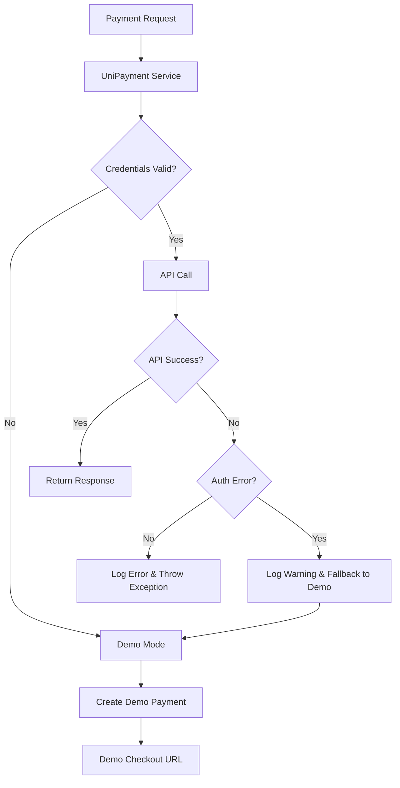
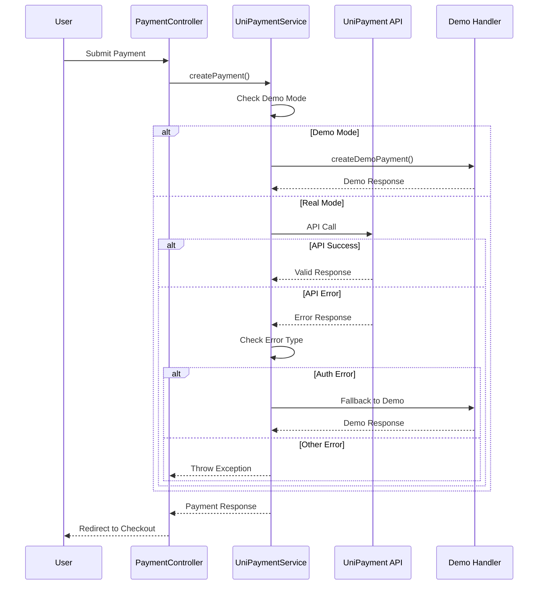

# UniPayment Error Handling Enhancement Design

## Overview

This design document outlines the implementation approach for improving UniPayment integration error handling, automatic fallback to demo mode, and enhanced user experience when payment API issues occur. The solution focuses on graceful degradation and comprehensive error handling.

## Architecture

### Error Handling Flow



### Component Interaction



## Components and Interfaces

### 1. Enhanced UniPaymentService

**Responsibilities:**

- Intelligent demo mode detection
- Graceful API error handling
- Automatic fallback mechanisms
- Comprehensive error logging

**Key Methods:**

```php
// Enhanced demo mode detection
protected function isDemoMode(): bool
protected function hasValidCredentials(): bool
protected function shouldFallbackToDemo(Exception $e): bool

// Improved error handling
protected function handleApiError(Exception $e, array $context): mixed
protected function logPaymentError(Exception $e, array $context): void

// Demo payment creation
protected function createDemoPayment(...): CreateInvoiceResponse
```

### 2. Demo Payment Handler

**Responsibilities:**

- Generate realistic demo payment responses
- Create demo checkout URLs
- Handle demo payment callbacks
- Simulate payment completion

**Implementation:**

```php
class DemoPaymentHandler
{
    public function createDemoInvoice(array $params): object
    public function generateCheckoutUrl(string $invoiceId, array $params): string
    public function simulatePaymentCallback(string $invoiceId): array
    public function markPaymentComplete(string $invoiceId): bool
}
```

### 3. Error Response Factory

**Responsibilities:**

- Create consistent error responses
- Map technical errors to user-friendly messages
- Provide fallback options

**Implementation:**

```php
class PaymentErrorResponseFactory
{
    public function createApiErrorResponse(Exception $e): array
    public function createFallbackResponse(string $reason): array
    public function createUserFriendlyMessage(string $errorType): string
}
```

### 4. Enhanced Demo Checkout Page

**Responsibilities:**

- Display realistic payment interface
- Show demo mode indicators
- Handle demo payment completion
- Redirect to success page

**Features:**

- Clear demo mode branding
- Realistic payment form
- Automatic payment completion
- Success/failure simulation

## Data Models

### Demo Payment Response Structure

```php
class DemoInvoiceResponse extends CreateInvoiceResponse
{
    private string $invoiceId;
    private string $checkoutUrl;
    private float $amount;
    private string $currency;
    private string $status = 'pending';
    private bool $isDemoMode = true;
}
```

### Error Context Structure

```php
interface PaymentErrorContext
{
    public function getErrorType(): string;
    public function getOriginalException(): Exception;
    public function getPaymentDetails(): array;
    public function shouldFallbackToDemo(): bool;
    public function getUserMessage(): string;
}
```

## Error Handling

### Error Classification

1. **Authentication Errors**

   - Invalid credentials
   - Expired tokens
   - Unauthorized access
   - **Action:** Automatic fallback to demo mode

2. **API Errors**

   - Network timeouts
   - Server errors (5xx)
   - Rate limiting
   - **Action:** Retry with exponential backoff, then fallback

3. **Validation Errors**

   - Invalid payment amounts
   - Unsupported currencies
   - Missing required fields
   - **Action:** Return validation error to user

4. **SDK Errors**
   - Serialization issues
   - Configuration problems
   - Library conflicts
   - **Action:** Log error and fallback to demo mode

### Error Recovery Strategies

```php
class PaymentErrorRecovery
{
    public function handleAuthenticationError(Exception $e): PaymentResponse
    {
        // Log warning and fallback to demo mode
        Log::warning('UniPayment authentication failed, using demo mode', [
            'error' => $e->getMessage(),
            'credentials_valid' => $this->hasValidCredentials()
        ]);

        return $this->createDemoPayment($this->paymentContext);
    }

    public function handleApiError(Exception $e): PaymentResponse
    {
        if ($this->isRetryableError($e)) {
            return $this->retryWithBackoff($e);
        }

        if ($this->shouldFallbackToDemo($e)) {
            return $this->fallbackToDemo($e);
        }

        throw new PaymentProcessingException($e->getMessage(), $e);
    }
}
```

## Testing Strategy

### Unit Tests

1. **Demo Mode Detection Tests**

   - Test credential validation logic
   - Test environment-based detection
   - Test fallback triggers

2. **Error Handling Tests**

   - Test each error type handling
   - Test fallback mechanisms
   - Test error logging

3. **Demo Payment Tests**
   - Test demo payment creation
   - Test demo checkout URL generation
   - Test demo callback simulation

### Integration Tests

1. **API Error Simulation**

   - Mock invalid credentials
   - Mock API timeouts
   - Mock server errors

2. **End-to-End Demo Flow**

   - Test complete demo payment flow
   - Test demo checkout page
   - Test demo payment completion

3. **Fallback Scenarios**
   - Test automatic fallback triggers
   - Test user experience during fallback
   - Test logging during fallback

### Error Scenarios Testing

```php
class UniPaymentErrorHandlingTest extends TestCase
{
    public function test_invalid_credentials_fallback_to_demo()
    public function test_api_timeout_retry_then_fallback()
    public function test_demo_mode_detection()
    public function test_error_logging_completeness()
    public function test_user_friendly_error_messages()
}
```

## Implementation Phases

### Phase 1: Core Error Handling

- Enhance UniPaymentService error handling
- Implement automatic demo mode fallback
- Add comprehensive error logging

### Phase 2: Demo Payment System

- Create demo payment handler
- Build demo checkout page
- Implement demo callback simulation

### Phase 3: User Experience

- Add user-friendly error messages
- Enhance demo mode indicators
- Improve error recovery flows

### Phase 4: Testing & Monitoring

- Comprehensive test suite
- Error monitoring and alerting
- Performance optimization

## Security Considerations

1. **Credential Protection**

   - Never log full credentials
   - Mask sensitive data in logs
   - Secure demo mode detection

2. **Demo Mode Security**

   - Clear demo mode indicators
   - Prevent demo payments in production
   - Secure demo callback handling

3. **Error Information Disclosure**
   - Sanitize error messages for users
   - Detailed logs for developers only
   - Prevent information leakage

## Performance Considerations

1. **Error Handling Overhead**

   - Minimize exception handling cost
   - Efficient demo mode detection
   - Fast fallback mechanisms

2. **Demo Mode Performance**

   - Lightweight demo responses
   - Minimal demo checkout page
   - Fast demo callback processing

3. **Logging Performance**
   - Asynchronous error logging
   - Log level optimization
   - Storage efficiency
